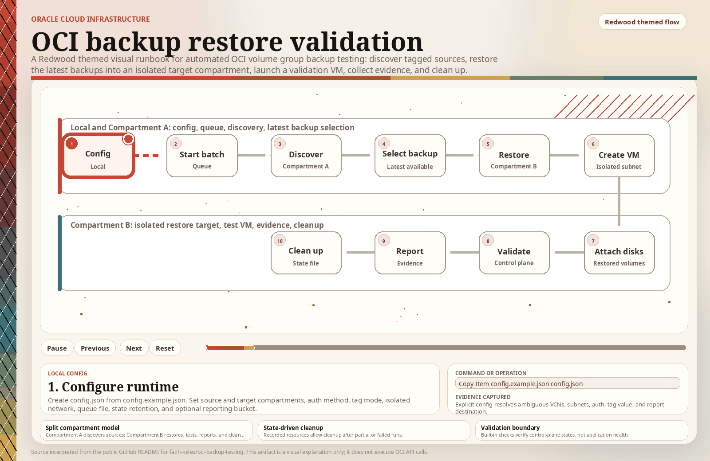

# OCI Backup Restore Validation

This project uses the OCI Python SDK to validate volume group backups by restoring each tagged volume group, launching a test instance from the restored boot volume in an isolated subnet, attaching restored block volumes, running control-plane validation, and recording everything needed for cleanup.

The workflow is intentionally strict. When a choice is ambiguous, for example multiple tagged VCNs or multiple usable subnets, it stops and asks you to make that choice in `config.json`.

## Workflow

<p align="center">
  <a href="https://fatih-keles.github.io/oci-backup-testing/oci_backup_testing_flow_redwood.html">
    
  </a>
</p>

<!-- <p align="center">
  <a href="https://fatih-keles.github.io/oci-backup-testing/oci_backup_testing_flow_redwood.html">
    Open the interactive workflow
  </a>
</p> -->

## Phases

1. Data Discovery
   Finds `AVAILABLE` volume groups in the compartment that match the configured `OCI-Backup-Testing` tag and selects the latest `AVAILABLE` volume group backup for each one.

2. Restore
   Restores each latest volume group backup with `CreateVolumeGroupDetails` and waits for the restored group to become `AVAILABLE`. Restored volume groups are named as `oci-restore-test-<source-volume-group-name>-<source-ocid-suffix>-<timestamp>`.

3. VM Creation
   Classifies the restored volumes, requires exactly one boot volume, launches `VM.Standard.E4.Flex` with 2 OCPU and 8 GB memory from that boot volume, and attaches restored block volumes.

4. Validation
   Confirms the restored volume group is `AVAILABLE`, the test instance is `RUNNING`, and each restored block volume attachment is `ATTACHED`.

5. Cleanup
   Uses the state file to terminate test instances, detach volumes, delete restored volume groups, and delete restored boot/block volumes.

## Setup

Create and activate a virtual environment, then install the project:

```powershell
python -m venv .venv
.\.venv\Scripts\Activate.ps1
pip install -e .
```

Create your runtime config:

```powershell
Copy-Item config.example.json config.json
```

Edit `config.json` before running. At minimum, provide:

- `source_compartment_id`: Compartment A, where the tagged source volume groups and volume group backups exist.
- `target_compartment_id`: Compartment B, where restored volume groups, restored volumes, and test instances should be created.
- `queue_file`: local batch queue used for cumulative compliance reports.
- `state_retention`: local state-file pruning policy. By default, `prune-state` keeps failed or uncleaned executions and prunes cleaned executions older than 30 days or above the latest 500 total executions.
- `auth`: confirm whether the VM uses an OCI config file, instance principals, or resource principals.
- `tag`: confirm whether `OCI-Backup-Testing` is a freeform tag or a defined tag, and whether a specific value must match.
- `network`: by default, tagged VCN/subnet discovery searches `target_compartment_id`. Set `vcn_compartment_id` or `subnet_compartment_id` only if the isolated network lives somewhere else. Set `subnet_id` if the tagged isolated VCN has more than one usable subnet. Use `subnet_id_by_availability_domain` if you have AD-specific subnets.
- `compute.ssh_public_key_path`: optional. Leave null if the restored boot volume already has the access you need or if control-plane validation is enough.
- `report`: optional but recommended for compliance evidence. Set `enabled=true` and provide the pre-created Object Storage `bucket_name`. Leave `namespace=null` to let the SDK resolve the tenancy namespace.

For old single-compartment setups, `compartment_id` is still accepted as a shortcut and is used as both source and target. For your two-compartment design, use the explicit source/target fields.

## Supported Compartment Layout

This project supports the split you described:

- Compartment A: source volume groups tagged with `OCI-Backup-Testing`, plus their volume group backups.
- Compartment B: isolated VCN/subnet, restored volume groups and volumes, and launched test instances.

The workflow uses Compartment A only for discovery and latest-backup selection. It uses Compartment B for restore destination, instance launch, and default network lookup.

## Commands

Start a new compliance batch:

```powershell
oci-backup-testing --config config.json init-batch
```

Show the source volume groups and latest backups that would be used:

```powershell
oci-backup-testing --config config.json discover
```

Plan the restore without creating OCI resources:

```powershell
oci-backup-testing --config config.json run --dry-run
```

Dry run validates backup selection and isolated subnet selection. It cannot know the restored boot and block volume OCIDs until the real restore creates them.

Run the full restore validation:

```powershell
oci-backup-testing --config config.json run --yes
```

After a real run, the command prints a short run summary listing each source volume group, launched test VM display name, instance OCID, and test status. It also updates the current report queue.

Run only one tagged source volume group by OCID:

```powershell
oci-backup-testing --config config.json run --volume-group-id ocid1.volumegroup.oc1..example --yes
```

Re-run validation for resources recorded in the state file:

```powershell
oci-backup-testing --config config.json validate
```

Generate and upload the current batch report:

```powershell
oci-backup-testing --config config.json report
```

The HTML report contains three evidence dimensions: volume group evidence, VM evidence, and disk evidence. Disk size is captured during new runs when OCI returns `size_in_gbs`; older queue entries created before this field existed may show disk size as unavailable.

Clean up resources recorded in the state file:

```powershell
oci-backup-testing --config config.json cleanup --yes
```

Clean only the latest execution:

```powershell
oci-backup-testing --config config.json cleanup --latest --yes
```

Prune cleaned executions from the state file:

```powershell
oci-backup-testing --config config.json prune-state
```

Preview pruning without changing the state file:

```powershell
oci-backup-testing --config config.json prune-state --dry-run
```

Show recent state-file progress without making OCI API calls:

```powershell
oci-backup-testing --config config.json status --limit 5
```

Clear the local report queue after the batch is complete:

```powershell
oci-backup-testing --config config.json close-batch
```

Typical batch flow:

```powershell
oci-backup-testing --config config.json init-batch
oci-backup-testing --config config.json run --volume-group-id ocid1.volumegroup.oc1..example1 --yes
oci-backup-testing --config config.json run --volume-group-id ocid1.volumegroup.oc1..example2 --yes
oci-backup-testing --config config.json report
oci-backup-testing --config config.json cleanup --yes
oci-backup-testing --config config.json prune-state
oci-backup-testing --config config.json close-batch
```

## Safety Notes

- The restored volume groups are not tagged with `OCI-Backup-Testing` by default, so future discovery runs do not pick up prior test restores.
- The state file is updated after each phase. If the workflow fails midway, run `cleanup --yes` after fixing the error.
- Cleanup marks successfully cleaned state entries with `cleanup_status=cleaned`; `prune-state` removes only those cleaned entries unless `state_retention.prune_only_cleaned=false`. If any cleanup delete/terminate option is disabled, cleanup marks entries as `completed` instead, so pruning will keep their OCIDs by default.
- The queue file is the current compliance batch. `init-batch` resets it, `run --yes` appends or updates execution entries, `report` uploads the batch report, and `close-batch` removes the queue.
- OCI deletes a volume group object without deleting its individual volumes, so cleanup deletes the restored boot and block volumes separately.
- Validation is control-plane only. Guest OS, application, or OCI-specific health checks still need concrete requirements before they should be automated.

## OCI SDK References Used

- [BlockstorageClient](https://docs.oracle.com/en-us/iaas/tools/python/latest/api/core/client/oci.core.BlockstorageClient.html)
- [ComputeClient](https://docs.oracle.com/en-us/iaas/tools/python/latest/api/core/client/oci.core.ComputeClient.html)
- [VirtualNetworkClient](https://docs.oracle.com/en-us/iaas/tools/python/latest/api/core/client/oci.core.VirtualNetworkClient.html)
- [CreateVolumeGroupDetails](https://docs.oracle.com/en-us/iaas/tools/python/latest/api/core/models/oci.core.models.CreateVolumeGroupDetails.html)
- [VolumeGroupSourceFromVolumeGroupBackupDetails](https://docs.oracle.com/en-us/iaas/tools/python/latest/api/core/models/oci.core.models.VolumeGroupSourceFromVolumeGroupBackupDetails.html)
- [InstanceSourceViaBootVolumeDetails](https://docs.oracle.com/en-us/iaas/tools/python/latest/api/core/models/oci.core.models.InstanceSourceViaBootVolumeDetails.html)
